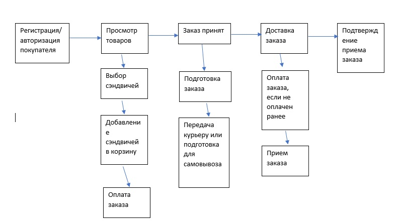

# Интернет-магазин по продаже сэндвичей

Разбиение по бизнес-возможностям

## Пользовательские сценарии

1. Есть авторизованный клиент
   И есть интернет-магазин по продаже сэндвичей
   И клиент вводит в строке поиска "Сэндвич с тунцом"
   Тогда появляется список сэндвичей, подходящих под запрос клиента
   И в карточке товара пользователь видит
    1.	Цену
    2.	Название
    3.	Изображение
    4.	Скидку
    5.	Состав сэндвича
    6.	Скидки и акции в зависимости от объема заказа
    7.	Список фирм по доставке заказа до клиента

2. Когда клиент нажимает на карточку сэндвича
   Тогда клиент переходит на страницу с описанием сэндвича

3. При добавлении сэндвича в заказ, все товары отображаются в корзине

4. Есть отдельная страница с указанием акций, где пользователь может посмотреть выгодные варианты покупки.

5. При оформлении заказа, когда клиент нажимает в корзине кнопку оформить, то появляется список фирм по доставке заказа или возможность забрать заказ самовывозом.

6.	Когда клиент выбирает конкретную фирму по доставке
      Тогда появляется форма с полями ввода адреса доставки и времени доставки
      При указании адреса появляется форма с указанием вариантов маршрута
      При выборе конкретного маршрута осуществляется расчет стоимости и времени доставки

7.	При заполнении данных о пользователе и указании всех опций по заказу, пользователь выбирает способ оплаты, сразу через сайт или при получении и оформляет заказ.

## Общая схема взаимодействия
Сервисы:
- Сервис управления клиентами
- Сервис управления каталогом продукции
- Сервис по оповещениям
- Сервис по оформлению заказов
- Сервис по доставке товаров
- Сервис управления платежами

## Назначение сервисов

- Сервис управления клиентами - отвечает за аутентификацию и авторизацию пользователя, регистрацию новых пользователей и восстановление пароля
- Сервис управления каталогом продукции - производит наполнение и просмотр информации о сэндвичах
- Сервис по оповещениям - отвечает за оповещение пользователя и магазина о заказе
- Сервис по оформлению заказов - система, создающая и дополняющая заказ в соответствии с действиями пользователя, просмотр товаров и добавление в корзину
- Сервис по доставке товаров - отвечает за формирование доставки, предоставляет выбор фирм по доставке, выбору маршрута и времени доставки
- Сервис управления платежами - производит оплату товара

## Контракты взаимодействия
1. Клиент register() - регистрация в системе
   - callPassword() - восстановление пароля
   - createOrder() - создание заказа

2. Сервис управления каталогом продукции -
   - showData() - просмотр сведений о сэндвиче
   - addData() - добавление сведений о сэндвиче
   - deleteData() - удаление сведений о сэндвиче

3. Сервис по оповещениям
   - notifyUser() - уведомление клиента
   - notifyCourier() - уведомление курьера
   - notifyFirm() - уведомление фирмы по продаже

3. Сервис по оформлению заказов -
   - addData() - добавление данных в заказ
   - acceptOrder() - прием заказа

4. Сервис по доставке товаров
   - showTransportFirms() - предоставляет список транспортных компаний
   - showRoutes() - предоставляет список маршрутов
   - acceptOrder() - принимает заказ

5. Сервис оплаты заказа
    - acceptPay() - прием оплаты

